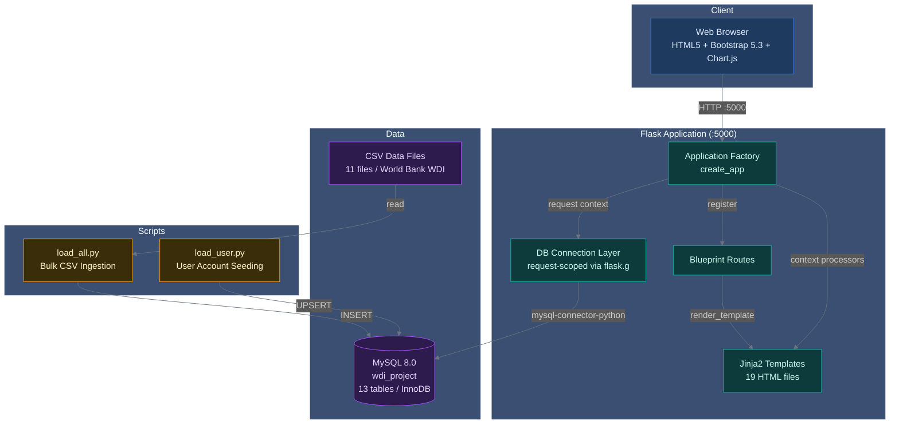

<div align="center">

  <h1>Database Management System</h1>

  <p><em>A comprehensive web-based database management and visualization platform for analyzing World Development Indicators (WDI) data across multiple domains</em></p>

  <p>
    <a href="#"></a>
    <a href="#"></a>
    <a href="#"></a>
    <a href="#"></a>
    <a href="#"></a>
    <a href="#"></a>
    <a href="https://github.com/yatuk/Database-Management-System/actions/workflows/ci.yml"></a>
  </p>

  <br />

  <table>
    <tr>
      <td align="center"><strong>Python</strong><br/><code>Flask</code></td>
      <td align="center"><strong>MySQL</strong><br/><code>InnoDB</code></td>
      <td align="center"><strong>Jinja2</strong><br/><code>Templates</code></td>
    </tr>
    <tr>
      <td align="center">Application Server<br/>+ Route Handlers</td>
      <td align="center">Relational Database<br/>+ FK Constraints</td>
      <td align="center">Server-Side Rendering<br/>+ Bootstrap 5.3</td>
    </tr>
  </table>

</div>

<br />

---

## What is this project?

This **Database Management System** provides an interactive platform for exploring, analyzing, and managing multi-domain indicator data from the World Development Indicators (WDI) dataset published by the World Bank. The system enables users to browse country-level and regional data, visualize trends through interactive charts and maps, perform cross-country comparisons, and manage data through role-based CRUD operations with full audit logging.

| Your need | System's answer |
|---|---|
| Browse WDI data across domains | 6 domains: Countries, Health, GHG, Energy, Freshwater, Sustainability |
| Visualize trends over time | Interactive line charts, sparklines, global trend views (Chart.js 4.4) |
| Geographic exploration | Interactive world map with country-level data availability |
| Control who edits data | Role-Based Access Control: Admin, Editor, Viewer |
| Track data changes | Full audit logging with user attribution |
| Export filtered data | CSV export with current filter state preserved |

> **Developed as a term project for BLG-317E (Database Systems) at Istanbul Technical University.**

---

## Architecture



```
┌──────────────────────────────────────────────────────────┐
│ Flask Application (:5000)                                │
│                                                          │
│  ┌────────────┐    ┌──────────────┐    ┌─────────────┐  │
│  │  Factory   │───>│  Blueprints  │    │  Templates  │  │
│  │  create_app│    │  9 modules   │    │  19 files   │  │
│  └─────┬──────┘    └──────────────┘    └──────────────┘  │
│        │                                                 │
│        ▼                                                 │
│  ┌──────────┐                                           │
│  │ DB Layer │  get_db() / close_db()                     │
│  │ flask.g  │  request-scoped connections                │
│  └────┬─────┘                                           │
└───────┼─────────────────────────────────────────────────┘
        │
        ▼
┌───────────┐     ┌──────────────┐
│ MySQL 8.0 │     │ CSV Loader   │
│ :3306     │<────│ load_all.py  │
└───────────┘     └──────────────┘
        ▲
        │ HTTPS :5000
   ┌────┴────┐
   │ Browser │
   └─────────┘
```

View the [D2 source](docs/architecture/architecture.d2).

### Component details

| Component | Language | Role | Key Files |
|---|---|---|---|
| **Application Factory** | Python | Flask app creation, blueprint registration, context processors | `App/routes/__init__.py` |
| **Route Handlers** | Python | Domain-specific CRUD, filtering, pagination, chart data APIs | `App/routes/*.py` |
| **Database Layer** | Python | Request-scoped MySQL connections, teardown hooks | `App/db.py`, `App/db_setup.py` |
| **Templates** | Jinja2/HTML | Responsive UI with Bootstrap 5.3 and Chart.js 4.4 | `frontend/css/templates/` |
| **Data Loader** | Python | CSV ingestion with deduplication and FK remapping | `scripts/load_all.py` |
| **User Seeder** | Python | Student account creation with role assignment | `scripts/load_user.py` |

---

## Database Schema

```mermaid
%%{init: {
  'theme': 'dark',
  'themeVariables': {
    'primaryColor': '#1e3a5f',
    'primaryTextColor': '#dbeafe',
    'primaryBorderColor': '#3b82f6',
    'lineColor': '#6b7280',
    'background': '#0f172a',
    'mainBkg': '#1e293b'
  }
}}%%
erDiagram
    students ||--o{ audit_logs : "logs"
    countries ||--o{ greenhouse_emissions : "has"
    countries ||--o{ health_system : "has"
    countries ||--o{ energy_data : "has"
    countries ||--o{ freshwater_data : "has"
    countries ||--o{ sustainability_data : "has"
    ghg_indicator_details ||--o{ greenhouse_emissions : "defines"
    health_indicator_details ||--o{ health_system : "defines"
    energy_indicator_details ||--o{ energy_data : "defines"
    freshwater_indicator_details ||--o{ freshwater_data : "defines"
    sustainability_indicator_details ||--o{ sustainability_data : "defines"

    countries {
        int country_id PK
        varchar country_name UK
        varchar country_code UK
        varchar region
        timestamp created_at
        timestamp updated_at
    }

    students {
        int student_id PK
        varchar student_number UK
        varchar full_name
        int team_no
    }

    audit_logs {
        int log_id PK
        int student_id FK
        varchar action_type
        varchar table_name
        int record_id
        timestamp action_timestamp
    }

    greenhouse_emissions {
        int row_id PK
        int country_id FK
        int ghg_indicator_id FK
        int indicator_value
        int share_of_total_pct
        int uncertainty_pct
        int year
        varchar source_notes
    }

    ghg_indicator_details {
        int ghg_indicator_id PK
        varchar indicator_name UK
        varchar indicator_description
        varchar unit_symbol
    }

    health_system {
        int row_id PK
        int country_id FK
        int health_indicator_id FK
        decimal indicator_value
        int year
        varchar source_notes
    }

    health_indicator_details {
        int health_indicator_id PK
        varchar indicator_name UK
        text indicator_description
        varchar unit_symbol
    }

    energy_data {
        int data_id PK
        int country_id FK
        int energy_indicator_id FK
        int year
        float indicator_value
        varchar data_source
    }

    energy_indicator_details {
        int energy_indicator_id PK
        varchar indicator_name UK
        varchar indicator_code UK
        text indicator_description
        varchar measurement_unit
    }

    freshwater_data {
        int data_id PK
        int country_id FK
        int freshwater_indicator_id FK
        int year
        decimal indicator_value
        varchar source_notes
    }

    freshwater_indicator_details {
        int freshwater_indicator_id PK
        varchar indicator_name UK
        text description
        varchar unit_of_measure
    }

    sustainability_data {
        int data_id PK
        int country_id FK
        int sus_indicator_id FK
        int year
        float indicator_value
        varchar source_note
    }

    sustainability_indicator_details {
        int sus_indicator_id PK
        varchar indicator_name UK
        varchar indicator_code UK
        text indicator_description
        varchar unit_symbol
    }
```



View the [D2 source](docs/architecture/database-schema.d2).

### Table Summary

| Table | Rows (approx.) | Description |
|---|---|---|
| `countries` | 250+ | Country master data with ISO3 codes and regional classification |
| `students` | 6 | User accounts with role assignments via `team_no` |
| `audit_logs` | variable | CRUD operation audit trail with user attribution |
| `greenhouse_emissions` | 8,000+ | CO2 total, CO2 per capita, total GHG by country/year |
| `health_system` | 25,000+ | Health indicators (life expectancy, mortality, etc.) |
| `energy_data` | 15,000+ | Energy consumption, production, renewable indicators |
| `freshwater_data` | 3,000+ | Freshwater resources, withdrawal, quality metrics |
| `sustainability_data` | 20,000+ | Environmental sustainability and resource management |

Each domain follows a consistent normalized pattern: a fact table referencing `countries` with a companion `*_indicator_details` lookup table. Unique constraints on `(country_id, indicator_id, year)` prevent duplicate records.

See `SQL/database.sql` for the complete DDL with all constraints and relationships.

---

## Features

| Category | Capability | Action |
|---|---|---|
| **Data Management** | Browse, filter, search, add, edit, delete | Full CRUD with role-based restrictions |
| **Visualization** | Line charts, bar charts, world map, sparklines | Chart.js 4.4 + Leaflet |
| **Filtering** | Country, region, year range, indicator, latest year only | Multi-criteria with dynamic dropdowns |
| **Search** | Full-text search across countries and indicators | Case-insensitive, partial match |
| **Pagination** | Server-side pagination | 50 records per page |
| **Export** | CSV download | Export filtered datasets with current state |
| **Trend Analysis** | Percentage change, year-over-year comparison | Automatic calculation per indicator |
| **Regional Aggregation** | AVG, MIN, MAX, country count per region | 5 domains, grouped by year |
| **Country Profiles** | Per-country data across all 5 domains | Joined queries with 500-row limit |
| **Region Profiles** | Aggregated statistics across all domains | Ranked country listing with CO2 metrics |

### Role-Based Access Control

| Role | `team_no` | Create | Read | Update | Delete |
|---|---|---|---|---|---|
| **Admin** | `1` | Yes | Yes | Yes | Yes |
| **Editor** | `2` | Yes | Yes | Yes | No |
| **Viewer** | Default | No | Yes | No | No |

The current user's role is injected into all templates via Flask context processors, making `current_role`, `is_admin`, `is_editor`, and `is_viewer` available in every Jinja2 template for UI-level access control.

Route protection is enforced via decorator functions:

```python
# App/routes/login.py
@editor_required   # Requires team_no in (1, 2)
def add_record():
    ...

@admin_required    # Requires team_no == 1
def delete_record():
    ...
```

---

## Technology Stack

<table>
  <tr>
    <th>Layer</th>
    <th>Technology</th>
  </tr>
  <tr>
    <td><strong>Backend Framework</strong></td>
    <td>
      
      &nbsp; Blueprint-based modular route architecture
    </td>
  </tr>
  <tr>
    <td><strong>Language</strong></td>
    <td>
      
    </td>
  </tr>
  <tr>
    <td><strong>Database</strong></td>
    <td>
      
      &nbsp; InnoDB engine, foreign key constraints, composite unique keys
    </td>
  </tr>
  <tr>
    <td><strong>Database Connector</strong></td>
    <td>
      
    </td>
  </tr>
  <tr>
    <td><strong>Environment Config</strong></td>
    <td>
      
    </td>
  </tr>
  <tr>
    <td><strong>Frontend</strong></td>
    <td>
      
      
      
    </td>
  </tr>
  <tr>
    <td><strong>UI Framework</strong></td>
    <td>
      
    </td>
  </tr>
  <tr>
    <td><strong>Charts</strong></td>
    <td>
      
    </td>
  </tr>
  <tr>
    <td><strong>Templating</strong></td>
    <td>
      
    </td>
  </tr>
</table>

---

## Project Structure

```
Database-Management-System/
├── App/
│   ├── routes/                  # Flask Blueprint route handlers
│   │   ├── __init__.py          # Application factory (create_app)
│   │   ├── dashboard.py         # Dashboard overview with coverage stats
│   │   ├── countries.py         # Country listing, profiles, regions, map API
│   │   ├── ghg.py               # GHG emissions domain (CRUD + filtering)
│   │   ├── health.py            # Health indicators domain (CRUD + filtering)
│   │   ├── energy.py            # Energy data domain (CRUD + filtering)
│   │   ├── freshwater.py        # Freshwater resources domain (CRUD + filtering)
│   │   ├── sustainability.py    # Sustainability metrics domain (CRUD + filtering)
│   │   ├── login.py             # Authentication, RBAC decorators, session management
│   │   └── about.py             # About page with team member listing
│   ├── db.py                    # Database connection utilities (request-scoped)
│   └── db_setup.py              # Database creation and schema initialization
├── Data/                        # CSV data files (World Bank WDI)
│   ├── countries.csv
│   ├── greenhouse_emissions.csv
│   ├── health_system.csv
│   ├── energy_data.csv
│   ├── freshwater_data.csv
│   ├── sustainability_data.csv
│   └── *_indicator_details.csv
├── SQL/                         # SQL scripts
│   ├── database.sql             # Full database schema (DDL)
│   └── load_*.sql               # Per-table data loading scripts
├── docs/
│   └── architecture/            # Architecture diagrams
│       ├── architecture.d2      # D2 system architecture source
│       └── database-schema.d2   # D2 database schema source
├── frontend/
│   ├── css/
│   │   ├── style.css            # Global styles
│   │   └── templates/           # Jinja2 HTML templates (19 files)
│   │       ├── base.html        # Base layout with navbar and footer
│   │       ├── dashboard.html   # Dashboard overview
│   │       ├── country_list.html
│   │       ├── country_profile.html
│   │       ├── country_no_data.html
│   │       ├── region_profile.html
│   │       ├── ghg_list.html    # 65K, most complex template
│   │       ├── ghg_form.html
│   │       ├── health_list.html
│   │       ├── health_form.html
│   │       ├── energy_list.html
│   │       ├── energy_form.html
│   │       ├── freshwater_list.html
│   │       ├── freshwater_form.html
│   │       ├── sustainability_list.html
│   │       ├── sustainability_form.html
│   │       ├── login.html
│   │       ├── about.html
│   │       ├── index.html
│   │       └── navbar.html
├── scripts/                     # Utility scripts
│   ├── load_all.py              # Bulk CSV loader with dedup and FK remapping
│   ├── load_user.py             # Seed admin/editor accounts
│   └── load_countries.py        # Country-specific loader
├── flask_app/                   # Alternative minimal Flask app
│   ├── server.py
│   ├── app/
│   ├── static/
│   └── templates/
├── main.py                      # Application entry point
├── requirements.txt             # Python dependencies (3 packages)
├── .python-version              # Python version pin (3.9.18)
└── .env                         # Environment variables (user-created)
```

---

## Installation

### Prerequisites

- **Python 3.9 or higher** -- [Download Python](https://www.python.org/downloads/)
- **MySQL 8.0 or higher** -- [Download MySQL](https://dev.mysql.com/downloads/mysql/)
- **pip** -- Python package manager (included with Python)
- **Git** -- [Download Git](https://git-scm.com/downloads)

### Step 1: Clone the Repository

```bash
git clone https://github.com/yatuk/Database-Management-System.git
cd Database-Management-System
```

### Step 2: Create Virtual Environment

**Windows:**
```bash
python -m venv venv
.\venv\Scripts\activate
```

**Linux/Mac:**
```bash
python3 -m venv venv
source venv/bin/activate
```

> If you encounter execution policy issues on Windows PowerShell:
> ```powershell
> Set-ExecutionPolicy -ExecutionPolicy RemoteSigned -Scope CurrentUser
> ```

### Step 3: Install Dependencies

```bash
pip install -r requirements.txt
```

### Step 4: Configure Environment

Create a `.env` file in the project root:

```env
DB_HOST=localhost
DB_USER=root
DB_PASSWORD=your_mysql_password
DB_NAME=wdi_project
DB_PORT=3306
SECRET_KEY=your_secret_key_here
```

### Step 5: Create and Populate Database

```bash
# Create the database in MySQL
mysql -u root -p -e "CREATE DATABASE wdi_project CHARACTER SET utf8mb4 COLLATE utf8mb4_unicode_ci;"

# Load schema and all CSV data (must run first)
python scripts/load_all.py

# Seed user accounts (must run second)
python scripts/load_user.py
```

> **Why this order matters:** `load_all.py` creates the schema and loads domain data. `load_user.py` requires existing tables. Reversing the order will fail.

### Step 6: Start the Application

```bash
python main.py
```

The application will be available at **http://localhost:5000**.

---

## Usage

### Default Login Credentials

After running `load_user.py`, log in with any of these accounts (no password required):

**Admin Accounts** (Full CRUD):

| Student Number | Name |
|---|---|
| `820230326` | Fatih Serdar Cakmak |
| `820230313` | Salih Sefer |
| `820230334` | Atahan Evintan |
| `820230314` | Muhammet Tuncer |
| `150210085` | Gulbahar Karabas |

**Editor Account** (Add/Edit only):

| Student Number | Name |
|---|---|
| `5454` | Editor User |

### Navigation

| Section | Path | Description |
|---|---|---|
| **Dashboard** | `/dashboard` | Overview of key indicators, domain coverage, year ranges |
| **Countries** | `/countries` | Browse countries, regional data, interactive world map |
| **Health** | `/health` | Health indicators with filtering and trend analysis |
| **GHG Emissions** | `/ghg` | Greenhouse gas emissions by country and year |
| **Energy** | `/energy` | Energy consumption, production, and renewable data |
| **Freshwater** | `/freshwater` | Freshwater resources and usage metrics |
| **Sustainability** | `/sustainability` | Environmental sustainability indicators |

---

## API Endpoints

### Authentication

| Method | Path | Auth | Description |
|---|---|---|---|
| `GET` | `/auth/login` | None | Login page |
| `POST` | `/auth/login` | None | Authenticate with student number |
| `GET` | `/auth/logout` | None | Clear session and redirect |

### Dashboard

| Method | Path | Auth | Description |
|---|---|---|---|
| `GET` | `/dashboard` | None | Main dashboard with domain coverage stats |

### Countries

| Method | Path | Auth | Description |
|---|---|---|---|
| `GET` | `/countries/` | None | List all countries with search |
| `GET` | `/countries/profile/<id>` | None | Country profile across all domains |
| `GET` | `/countries/region/<name>` | None | Region profile with aggregated stats |
| `GET` | `/countries/resolve/<iso2>` | None | Resolve ISO2 code to country profile |
| `GET` | `/countries/api/stats` | None | Global statistics (JSON) |
| `GET` | `/countries/api/region-stats` | None | Region statistics (JSON) |
| `GET` | `/countries/api/has-data/<iso2>` | None | Data availability check (JSON) |

### Domain CRUD (GHG, Health, Energy, Freshwater, Sustainability)

| Method | Path | Auth | Description |
|---|---|---|---|
| `GET` | `/<domain>/` | None | List records with filtering, sorting, pagination |
| `GET` | `/<domain>/api/get/<id>` | None | Get single record (JSON) |
| `POST` | `/<domain>/api/add` | Editor/Admin | Add new record |
| `POST` | `/<domain>/api/edit/<id>` | Editor/Admin | Edit existing record |
| `POST` | `/<domain>/api/delete/<id>` | Admin | Delete record |

### About

| Method | Path | Auth | Description |
|---|---|---|---|
| `GET` | `/about` | None | About page with team members |

---

## Troubleshooting

| Issue | Solution |
|---|---|
| **Database connection error** | Verify MySQL is running; check `.env` credentials; ensure `wdi_project` database exists |
| **Import errors** | Activate virtual environment; run `pip install -r requirements.txt` |
| **Wrong script execution order** | Drop and recreate database, then run `load_all.py` before `load_user.py` |
| **PowerShell execution policy** | `Set-ExecutionPolicy -ExecutionPolicy RemoteSigned -Scope CurrentUser` |
| **Module not found** | Ensure you are in project root; verify venv is activated |
| **Port 5000 in use** | Set `FLASK_RUN_PORT` in `.env` or modify `main.py` |

---

## License

This project is developed for **educational purposes** as part of the **BLG-317E Database Systems** course at Istanbul Technical University.

---

## Acknowledgments

- **World Bank** for providing the World Development Indicators (WDI) dataset
- **Flask** and **Bootstrap** communities for excellent documentation
- **Chart.js** for powerful visualization capabilities
- Course instructors and teaching assistants at ITU

---

## Links

| Resource | Location |
|---|---|
| **Database Schema (DDL)** | [SQL/database.sql](SQL/database.sql) |
| **Architecture D2 Source** | [docs/architecture/architecture.d2](docs/architecture/architecture.d2) |
| **Database Schema D2 Source** | [docs/architecture/database-schema.d2](docs/architecture/database-schema.d2) |
| **Data Loader Script** | [scripts/load_all.py](scripts/load_all.py) |
| **User Seed Script** | [scripts/load_user.py](scripts/load_user.py) |
| **Application Entry Point** | [main.py](main.py) |
| **Route Handlers** | [App/routes/](App/routes/) |
| **HTML Templates** | [frontend/css/templates/](frontend/css/templates/) |
| **CSV Data Files** | [Data/](Data/) |

<br />

<div align="center">
  <sub>Built by Team 1 for BLG-317E Database Systems</sub>
</div>
